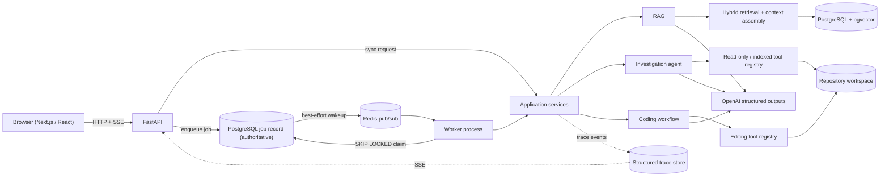

# RepoMind

[](https://github.com/phenstee/RepoMind/actions/workflows/ci.yml)

RepoMind is an AI software-engineering system for understanding and making
controlled changes to unfamiliar repositories. It answers grounded questions
about a codebase, investigates it with a read-only tool-using agent, and can
make small, verified edits under deterministic tests/lint/Git gates — all
through a FastAPI backend, a durable PostgreSQL-backed job system, and a
Next.js frontend.

## Contents

- [What RepoMind does](#what-repomind-does)
- [Why this is technically interesting](#why-this-is-technically-interesting)
- [Architecture](#architecture)
- [Evaluation](#evaluation)
- [Tech stack](#tech-stack)
- [Quickstart](#quickstart)
- [How it works](#how-it-works)
- [Safety and engineering constraints](#safety-and-engineering-constraints)
- [Development](#development)
- [Repository structure](#repository-structure)
- [Limitations](#limitations)

## What RepoMind does

| Capability | What it means |
| --- | --- |
| **Understand** | Deterministic ingestion and chunking (line-based baseline, plus Python AST-structural chunking) turn a repository into citation-ready source chunks. |
| **Retrieve** | Semantic (pgvector) + BM25 + symbol-name signal, fused with Reciprocal Rank Fusion, with an optional bounded LLM reranking stage. |
| **Investigate** | A handwritten read-only tool-using agent answers open-ended questions with an optional indexed-navigation tool, always verified against current source. |
| **Modify safely** | A controlled editing agent makes exact, bounded file changes — no arbitrary shell access, ever. |
| **Verify** | Coding changes go through a structured plan, deterministic pytest/Ruff checks, an independent structured review, and a completion gate the model cannot override. |
| **Run asynchronously / observe** | Long operations run as durable PostgreSQL-backed jobs with Redis wakeups, cooperative cancellation, structured tracing, and Server-Sent Events progress. |

## Why this is technically interesting

- **Hybrid retrieval fused, not blended.** Semantic, BM25, and symbol-name
  signal are combined with Reciprocal Rank Fusion rather than mixing
  incomparable raw scores; each source is independently swappable and
  measurable.
- **HNSW acceleration with an exact baseline kept.** PostgreSQL/pgvector
  exact cosine search remains the reference implementation; HNSW is an
  explicit, opt-in acceleration path measured against it with ANN Recall@k.
- **Indexed search is navigation, not evidence.** A persisted retrieval index
  can go stale relative to the working tree. The indexed tool returns only
  locations, never file content, and a runtime policy blocks the agent from
  finalizing an answer on an indexed hit until it has actually re-read the
  current file at that location.
- **Explicit, additive tool boundaries.** Read-only (6 tools) → investigation
  (+1 indexed-search tool) → editing (+4 controlled mutation/verification
  tools) are separate registries. No tool ever exposes an arbitrary shell.
- **Deterministic gates outrank model prose.** A coding task's completion
  gate is Python code checking real pytest/Ruff results and real Git
  diffs — a confident-sounding model claim cannot substitute for a failed
  check.
- **Bounded structured calls, not an uncontrolled agent swarm.** A planner
  and an independent reviewer are each one typed structured-output call
  inside a single coding workflow — this is not a multi-agent architecture.
- **PostgreSQL owns job truth; Redis only wakes workers up.** Durable job
  state and atomic `SKIP LOCKED` claiming live in PostgreSQL; Redis provides
  best-effort wakeup and progress fanout and can be lost without losing a
  job.
- **Evaluation is reproducible and provenance-stamped.** Every report
  records benchmark version, harness schema version, model, and the
  code-under-test Git SHA — see [Evaluation](#evaluation).

Deeper rationale for these and other decisions: [`docs/architecture.md`](docs/architecture.md).

## Architecture



Full retrieval, agent/tool, coding-workflow, and jobs/tracing detail —
including the design decisions behind these boundaries — is in
[`docs/architecture.md`](docs/architecture.md).

## Evaluation

RepoMind commits a real, paid live-model run of its own navigation benchmark
at [`benchmarks/results/repo-agent-eval-v3-live.json`](benchmarks/results/repo-agent-eval-v3-live.json)
so results are checkable, not just claimed.

This is a **controlled synthetic repository-navigation benchmark**, not a
general coding-agent accuracy claim. It measures whether a real model
(`gpt-5.6-terra`, via the real agent loop and real tool registries) can
investigate a small fixture repository and answer correctly, across six
categories: exact symbol lookup, semantic terminology mismatch, cross-file
evidence, literal lookup, indexed miss with filesystem fallback, and source
prompt injection.

| Retrieval mode | Cases | Task success | Mean tool calls | Verified retrieval follow-up |
| --- | --- | --- | --- | --- |
| Filesystem | 5 | 1.000 | 2.600 | 1.000 |
| Indexed | 6 | 1.000 | 2.333 | 1.000 |

RepoMind passed all applicable cases in this controlled live navigation
benchmark. (Indexed mode has one more applicable case: the indexed-miss
fallback case only exists in indexed mode.)

**Do not over-read this run:** indexed navigation used fewer mean tool calls
here, but it used *more* total model tokens (33,754 vs. 26,256) — this run
does not show indexed navigation is cheaper, faster, or more efficient
overall.

This live result is separate from RepoMind's deterministic offline
benchmarks (fake LLMs/embeddings, no OpenAI calls). Their evaluation logic
is covered by CI's `pytest` suite; CI does not invoke the benchmark CLIs
themselves. The paid live evaluation is never run automatically and never
runs in CI — it requires an explicit `--confirm-live` flag and a configured
API key. Full methodology,
every offline benchmark, exact commands (including the paid-run warning),
and artifact provenance: [`docs/evaluation.md`](docs/evaluation.md).

## Tech stack

| Layer | Technology |
| --- | --- |
| Backend | Python 3.13, FastAPI, Pydantic, SQLAlchemy, Alembic |
| Retrieval / data | PostgreSQL, pgvector, HNSW, BM25, Reciprocal Rank Fusion |
| Coordination | Redis (worker wakeup + progress fanout) |
| AI | OpenAI SDK (structured outputs, embeddings) |
| Frontend | Next.js, React, TypeScript |
| Infra | Docker Compose, GitHub Actions |
| Testing | pytest, Ruff, Vitest, ESLint, TypeScript |

## Quickstart

The easiest way to run the full stack is Docker Compose.

```powershell
git clone https://github.com/phenstee/RepoMind.git
cd RepoMind
Copy-Item .env.example .env
```

Edit `.env` and set `OPENAI_API_KEY` (required for indexing, retrieval, RAG
answers, and the agents — the app starts without it, but model/embedding
operations will fail). Then put any repository you want RepoMind to inspect
under the local `workspace/` directory — **only place trusted repositories
there** (see [Safety](#safety-and-engineering-constraints)).

```powershell
docker compose up --build
```

This starts PostgreSQL, Redis, runs Alembic migrations automatically (the
`migrate` service runs `alembic upgrade head` before `api`/`worker` start —
no manual migration step needed), and starts the API, worker, and frontend.

- Frontend: <http://127.0.0.1:3000>
- API docs (Swagger UI): <http://127.0.0.1:8000/docs>
- API health check: <http://127.0.0.1:8000/api/v1/health>

All Compose ports bind to `127.0.0.1` only (loopback) — this stack is meant
for trusted local development, not a public deployment.

## How it works

### Ask (RAG)

```text
question -> hybrid retrieval -> context assembly -> structured answer + citations
```

### Investigate

```text
task -> read-only tool loop -> optional indexed navigation
     -> current-source verification -> answer
```

### Code

```text
task -> clean-worktree preflight -> planner -> controlled editing
     -> deterministic pytest/Ruff verification -> Git diff/status evidence
     -> independent structured review -> completion gate
```

## Safety and engineering constraints

- **Read-only by default.** Investigation uses six read-only tools; editing
  is a separate, explicitly opted-into registry.
- **No arbitrary shell tool is ever exposed to the model.** Git inspection
  and pytest/Ruff verification use fixed subprocess argument arrays only.
- **Controlled, exact editing only.** File creation and one-occurrence exact
  literal replacement with a SHA-256 precondition — not free-form patching.
- **Current filesystem is authority over persisted retrieval.** An indexed
  navigation hit cannot become a final answer without a fresh `read_file` on
  a current-worktree path.
- **Bounded everywhere.** Fixed agent iteration limits, bounded history,
  bounded tool output, repeated-call protection.
- **Deterministic gates the model cannot override.** pytest/Ruff pass/fail
  and Git evidence are application-owned checks, evaluated in Python.
- **Git publication is human-controlled.** No `commit`, `push`, `reset`, or
  `clean` capability is registered for the model — RepoMind never commits or
  pushes on its own.
- **No authentication/authorization exists.** The API is for trusted local
  development only; do not expose it beyond loopback without adding auth.
- **Tests executed by the coding workflow are not a sandbox.** `run_tests`
  and `run_ruff` execute real pytest/Ruff against the real workspace — only
  point RepoMind at repositories you trust.

## Development

Backend:

```powershell
uv sync
uv run alembic upgrade head   # against a local Postgres, e.g. docker compose up -d postgres
uv run ruff check .
uv run pytest
```

Frontend:

```powershell
cd frontend
npm ci
npm run lint
npm run typecheck
npm test
npm run build
```

GitHub Actions CI (`.github/workflows/ci.yml`) runs on every push to `main`
and every pull request, with two jobs:

- **backend** — real PostgreSQL (`pgvector/pgvector`) and Redis services,
  locked `uv sync`, lockfile check, `alembic upgrade head`, `ruff check .`,
  `pytest` (including real-Postgres/Redis integration tests — no OpenAI
  calls; those use injected fakes).
- **frontend** — `npm ci`, lint, typecheck, `vitest`, `next build`.

The paid live evaluation benchmark (see [Evaluation](#evaluation)) never runs
in CI.

## Repository structure

```text
RepoMind/
├── src/repomind/
│   ├── api/            FastAPI app, routes, request/response models, SSE
│   ├── agent/           Handwritten read-only/investigation agent loop
│   ├── coding/          Coding workflow: planner, executor, reviewer, gates
│   ├── db/               SQLAlchemy models, persisted hybrid retrieval
│   ├── evaluation/        Offline benchmark harness (retrieval/RAG/coding)
│   ├── ingestion/         Repository discovery + chunking
│   ├── jobs/               Durable PostgreSQL jobs, Redis wakeup, worker
│   ├── llm/                 OpenAI client wrapper
│   ├── observability/        Structured tracing, persistence, SSE projection
│   ├── rag/                   RAG pipeline + context assembly
│   ├── retrieval/               Semantic/BM25/symbol retrieval, RRF, reranking
│   ├── tools/                    Read-only + editing tool registries
│   └── worker.py                  Worker process entry point
├── frontend/               Next.js + TypeScript UI (Ask / Investigate / Code)
├── benchmarks/              Offline + live evaluation harness CLIs
│   └── results/               Committed live evaluation artifact
├── alembic/                    Database migrations
├── scripts/                     Manual/optional live-API smoke checks
├── tests/                        Unit + PostgreSQL/Redis integration tests
├── docs/                          architecture.md, evaluation.md
├── docker-compose.yml
├── Dockerfile / frontend/Dockerfile
└── .github/workflows/ci.yml
```

## Limitations

- **Trusted-local environment only.** No authentication/authorization; do
  not expose the API beyond loopback without adding it.
- **Retrieval index can be stale relative to the working tree.** RepoMind
  mitigates this with mandatory current-source verification after indexed
  navigation rather than treating the index as authoritative.
- **The coding agent does not use indexed navigation.** It always operates
  on the filesystem-only tool set.
- **BM25 has no persisted index.** It is rebuilt in memory from persisted
  chunks on every hybrid query — a scaling limit at large repository sizes.
- **No arbitrary shell execution anywhere**, by design, not as a
  not-yet-implemented gap.
- **No automatic Git publication.** RepoMind never commits or pushes;
  reviewing and publishing changes is always a human action.

---

For engineering depth beyond this page: [`docs/architecture.md`](docs/architecture.md)
and [`docs/evaluation.md`](docs/evaluation.md).
