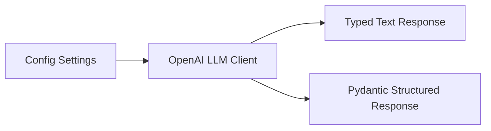

# RepoMind

RepoMind is an autonomous AI software engineer for understanding, modifying,
and debugging unfamiliar codebases. The project is deliberately built in small,
verifiable milestones rather than as one monolithic prototype.

## Current status

**Milestone 1: LLM foundation** is implemented. It includes:

- a Python 3.13 project managed with `uv` and a `src/repomind` package layout
- centralized configuration via `pydantic-settings`
- a reusable OpenAI client with text generation and structured output
- explicit retry and error handling
- normalized, typed response models
- mocked unit tests that do not require an API key or network access
- an optional manual live-API check script

Later milestones will add repository ingestion, code chunking, embeddings,
semantic/hybrid retrieval, RAG, tools, the handwritten agent loop, code editing,
tests/self-correction, permissions, memory, multi-agent orchestration,
observability, evaluations, FastAPI, a Next.js frontend, Redis, Docker, and CI.

## Repository layout

```text
RepoMind/
├── src/
│   └── repomind/
│       ├── config.py
│       └── llm/
│           ├── client.py
│           ├── models.py
│           └── structured.py
├── scripts/
│   └── manual_llm_check.py
├── tests/
│   └── unit/
│       ├── test_config.py
│       └── test_llm_client.py
├── .env.example
├── .gitignore
├── pyproject.toml
├── uv.lock
└── README.md
```

## Architecture

The application is split into small, independently testable layers:



`OpenAILLMClient` wraps the official OpenAI SDK. The rest of the codebase
depends on RepoMind's own `LLMResponse`, `TokenUsage`, and Pydantic response
models, not on raw SDK objects.

## Setup

Prerequisites:

- Python 3.13
- `uv`

Install dependencies:

```powershell
uv sync
```

Create a local environment file if you want to run live checks:

```powershell
Copy-Item .env.example .env
```

Then set `OPENAI_API_KEY` in `.env`. Never commit `.env`.

## Tests

Run the full unit test suite:

```powershell
uv run pytest
```

Run linting:

```powershell
uv run ruff check .
```

## Optional live check

With a valid `OPENAI_API_KEY` configured:

```powershell
uv run python scripts/manual_llm_check.py
```

This script makes real API calls and is not part of the automated test suite.

## Design decisions

- **No agent framework yet.** Milestone 1 uses only the official OpenAI SDK. The
  first agent loop will be handwritten so its mechanics remain visible.
- **Provider abstraction stays small.** Normalized response models keep the
  SDK boundary contained and testable.
- **Secrets are externalized.** All environment configuration flows through
  `repomind.config.Settings`, and `.env` is gitignored.
- **Tests are offline by default.** SDK objects are injected in tests, so CI and
  local development do not require paid API calls.

## Roadmap

The full project roadmap is described in the RepoMind engineering brief:

1. LLM foundation (current)
2. Repository ingestion
3. Code chunking
4. Embeddings
5. Semantic search
6. Basic RAG
7. PostgreSQL + pgvector persistence
8. Hybrid retrieval
9. Reranking
10. Tool system
11. Handwritten agent loop
12. Read-only software engineering agent
13. Planning
14. Controlled code editing
15. Test execution and self-correction
16. Human approval and security
17. Memory
18. Multi-agent architecture
19. MCP
20. Evaluations
21. Observability
22. FastAPI backend
23. Streaming
24. Next.js frontend
25. Redis + background workers
26. Docker
27. CI
28. Optional agent framework comparison
