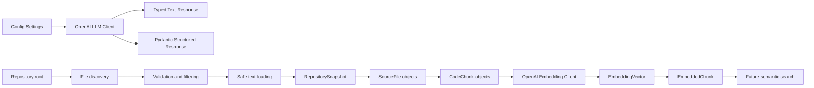

# RepoMind

RepoMind is an autonomous AI software engineer for understanding, modifying,
and debugging unfamiliar codebases. The project is deliberately built in small,
verifiable milestones rather than as one monolithic prototype.

## Current status

**Milestone 1: LLM foundation** is complete. It includes:

- a Python 3.13 project managed with `uv` and a `src/repomind` package layout
- centralized configuration via `pydantic-settings`
- a reusable OpenAI client with text generation and structured output
- explicit retry and error handling
- normalized, typed response models
- mocked unit tests that do not require an API key or network access
- an optional manual live-API check script

**Milestone 2: repository ingestion** is complete. RepoMind can now safely
discover, filter, decode, and represent supported source files without calling
the LLM layer.

**Milestone 3: deterministic code chunking** is complete. RepoMind can now
transform `SourceFile` objects into ordered, citation-ready `CodeChunk` objects
using a deterministic line-based baseline.

**Milestone 3.5: hardening** is complete. Async retries are event-loop safe,
configuration secrets and bounds are validated, and repository reads and path
metadata have additional safety checks.

**Milestone 4: embeddings** is complete. RepoMind can transform arbitrary text,
text batches, and `CodeChunk` objects into validated numerical vectors using a
separate synchronous/asynchronous OpenAI embedding client.

Later milestones will add semantic/hybrid retrieval, RAG, tools, the handwritten
agent loop, code editing, tests/self-correction, permissions, memory, multi-agent
orchestration, observability, evaluations, FastAPI, a Next.js frontend, Redis,
Docker, and CI.

## Repository ingestion

`repomind.ingestion` traverses a local repository, skips generated or ignored
directories, filters supported source files, and returns a
`RepositorySnapshot`. `SourceFile` objects expose only a repository-relative
path, preserving privacy around local absolute paths.

Supported extensions include:

```text
.py .ts .tsx .js .jsx .go .java .rs .cpp .cc .c .h .hpp .cs
.md .json .yaml .yml .toml .sql .sh .ps1
```

Default ignored directories include `.git`, virtual environments, caches,
`node_modules`, build output, and IDE directories. `.github` is deliberately
ingested when it contains supported text files because CI/workflow
configuration is meaningful project context.

Safety behaviors:

- symlinked files/directories and Windows junction directories are skipped
- discovered paths are resolved and containment-checked against the repository root
- reads are bounded; files over 1 MiB are skipped and reported
- files with null bytes anywhere in the bounded payload are treated as binary and skipped
- UTF-8 and UTF-8 BOM are supported; legacy `cp1252` text is used as a fallback
- undecodable files are skipped and reported
- line counts use Python `splitlines()` semantics

Ingestion assumes the repository is not maliciously mutated concurrently while
it is being read. Static traversal is protected, but fully race-free path
handling would require substantially more platform-specific file-handle logic.

## Code chunking

`chunk_source_file` splits a `SourceFile` into smaller `CodeChunk` objects.
`chunk_repository` applies that process across all files in a
`RepositorySnapshot` and returns one flat, deterministically ordered list.

The current baseline is simple line-based chunking:

- `max_lines_per_chunk` defaults to 120
- `overlap_lines` defaults to 20
- chunk line numbers are 1-based and inclusive
- chunk indexes restart at zero for each file
- empty files produce no chunks

Overlap exists because code near a chunk boundary often depends on surrounding
context. Repeating nearby lines helps prevent that context from being split
completely across two retrieval units.

Chunking is intentionally deterministic and synchronous. It does not perform
embeddings, retrieval, or syntax-aware parsing.

## Embeddings

Embeddings convert text into high-dimensional numerical vectors whose geometry
captures aspects of semantic similarity. Milestone 4 implements vector
generation only:

```text
CodeChunk
    ↓ exact content
OpenAI embedding model
    ↓
EmbeddingVector
    ↓ paired with the original chunk
EmbeddedChunk
```

`OpenAIEmbeddingClient` supports single text, text batches, and `CodeChunk`
batches through synchronous and asynchronous methods. It uses the model selected
by `OPENAI_EMBEDDING_MODEL` and reuses the existing OpenAI timeout and retry
settings rather than duplicating them.

Requests are split deterministically into batches of 64 items by default. API
response indices are validated and used to restore input order, vectors must be
non-empty and finite, and dimensionality must remain consistent across the
operation. Usage returned by the provider is aggregated so future indexing cost
can be measured. Batching is currently based on item count; token-aware batching
is a future improvement.

Chunk content is sent exactly as stored, including indentation and newline
characters. Empty strings are rejected; whitespace-only strings are deliberately
allowed without stripping.

Vectors are immutable Python tuples held only in memory. RepoMind does **not**
yet compare vectors, perform semantic search or retrieval, or store embeddings
in a vector database. Automated embedding tests inject fake SDK clients and
never make live API calls.

## Repository layout

```text
RepoMind/
├── src/
│   └── repomind/
│       ├── config.py
│       ├── ingestion/
│       │   ├── __init__.py
│       │   ├── chunker.py
│       │   ├── language.py
│       │   ├── models.py
│       │   └── repository.py
│       ├── llm/
│       │   ├── client.py
│       │   └── models.py
│       └── retrieval/
│           ├── __init__.py
│           ├── embeddings.py
│           └── models.py
├── scripts/
│   ├── inspect_repository.py
│   ├── manual_embedding_check.py
│   └── manual_llm_check.py
├── tests/
│   └── unit/
│       ├── ingestion/
│       │   ├── test_chunker.py
│       │   ├── test_language.py
│       │   ├── test_models.py
│       │   └── test_repository.py
│       ├── retrieval/
│       │   ├── test_embedding_models.py
│       │   └── test_embeddings.py
│       ├── test_config.py
│       └── test_llm_client.py
├── .env.example
├── .gitignore
├── pyproject.toml
├── uv.lock
└── README.md
```

## Architecture

The application is split into small, independently testable layers:



`OpenAILLMClient` wraps the official OpenAI SDK. The rest of the codebase
depends on RepoMind's own `LLMResponse`, `TokenUsage`, and Pydantic response
models, not on raw SDK objects. `OpenAIEmbeddingClient` is separate because
language generation and numerical representation are distinct responsibilities.

## Setup

Prerequisites:

- Python 3.13
- `uv`

Install dependencies:

```powershell
uv sync
```

Create a local environment file if you want to run live checks:

```powershell
Copy-Item .env.example .env
```

Then set `OPENAI_API_KEY` in `.env`. Never commit `.env`.

## Tests

Run the full unit test suite:

```powershell
uv run pytest
```

Run linting:

```powershell
uv run ruff check .
```

## Optional live checks

With a valid `OPENAI_API_KEY` configured:

```powershell
uv run python scripts/manual_llm_check.py
```

This script makes real API calls and is not part of the automated test suite.

Run the separate, single-text embedding smoke check with:

```powershell
uv run python scripts/manual_embedding_check.py
```

It prints the model, dimensions, usage, and only the first five vector values.
Without an API key it exits without making a request.

## Optional ingestion check

Inspect a repository without using the LLM:

```powershell
uv run python scripts/inspect_repository.py .
```

Include deterministic chunking statistics:

```powershell
uv run python scripts/inspect_repository.py . --chunks
```

## Design decisions

- **No agent framework yet.** Milestone 1 uses only the official OpenAI SDK. The
  first agent loop will be handwritten so its mechanics remain visible.
- **Provider abstraction stays small.** Normalized response models keep the
  SDK boundary contained and testable.
- **Secrets are externalized.** All environment configuration flows through
  `repomind.config.Settings`, and `.env` is gitignored.
- **Tests are offline by default.** SDK objects are injected in tests, so CI and
  local development do not require paid API calls.
- **Chunking starts with a deterministic baseline.** Line-based chunking is
  deliberately simple so later syntax-aware strategies can be compared against
  a stable reference.
- **Embedding generation stays separate.** It uses the official OpenAI SDK
  directly, normalizes provider responses, and keeps vectors associated with
  their source chunks.
- **No NumPy yet.** Tuples are sufficient to generate and hold vectors. NumPy
  belongs in Milestone 5, when vector comparison is introduced.
- **Embeddings stay in memory.** Persistence and vector databases follow only
  after the in-memory retrieval pipeline is understood and verified.

## Roadmap

The full project roadmap is described in the RepoMind engineering brief:

1. LLM foundation (complete)
2. Repository ingestion (complete)
3. Code chunking (complete)
4. Embeddings (complete)
5. Semantic search (next)
6. Basic RAG
7. PostgreSQL + pgvector persistence
8. Hybrid retrieval
9. Reranking
10. Tool system
11. Handwritten agent loop
12. Read-only software engineering agent
13. Planning
14. Controlled code editing
15. Test execution and self-correction
16. Human approval and security
17. Memory
18. Multi-agent architecture
19. MCP
20. Evaluations
21. Observability
22. FastAPI backend
23. Streaming
24. Next.js frontend
25. Redis + background workers
26. Docker
27. CI
28. Optional agent framework comparison
