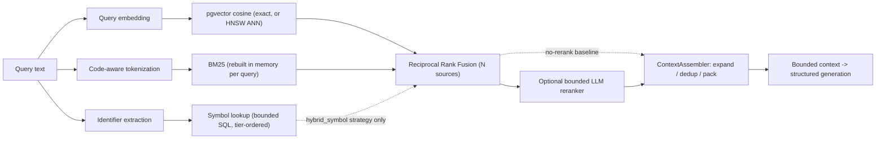
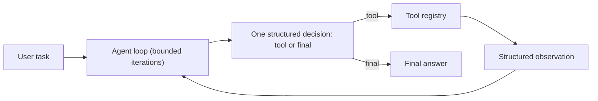
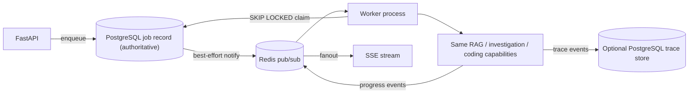

# Architecture

Deeper technical detail behind the [README](../README.md) summary. This
describes the system as implemented at `src/repomind/` and `frontend/`, not
historical development intent.

## Contents

- [Retrieval](#retrieval)
- [Incremental indexing](#incremental-indexing)
- [Agent and tool boundaries](#agent-and-tool-boundaries)
- [Indexed navigation and current-source authority](#indexed-navigation-and-current-source-authority)
- [Coding workflow and completion gates](#coding-workflow-and-completion-gates)
- [Jobs, worker, and tracing](#jobs-worker-and-tracing)
- [Selected design decisions](#selected-design-decisions)

## Retrieval



Four retrieval strategies are selectable per request (`semantic`, `hybrid`,
`hybrid_rerank`, `hybrid_symbol`); `semantic` is the API default.

- **Chunking.** Deterministic line-based chunking (`ingestion/chunker.py`) is
  the baseline for every language. Python source can additionally opt into
  AST-anchored structural chunking (`ingestion/structural.py`), which slices
  original source, bounds oversized symbols, and falls back to line
  boundaries rather than failing indexing.
- **Semantic search.** Exact pgvector cosine search is the reference
  implementation; an HNSW index (`alembic/versions/20260917_01_retrieval_v2.py`)
  is an explicit, optional acceleration path measured against it with
  ANN Recall@k, not a silent replacement.
- **BM25.** A small dependency-free implementation
  (`retrieval/bm25.py`) with inspectable IDF/saturation/length-normalization
  math. It has **no persisted index** — `db/hybrid.py` rebuilds a `BM25Index`
  from `load_chunks(session, repository_id)` on every hybrid query. This is a
  known scaling limit (see [Limitations](../README.md#limitations)).
- **Symbol fusion.** `retrieval/symbols.py` reuses `symbol_name`/
  `qualified_symbol_name` metadata the chunker already produced. It is one
  bounded, repository-scoped SQL query with tier-ordered ranking over two
  B-tree indexes — never a graph traversal, reparse, or second embedding
  call. This is deliberately **not** GraphRAG, a call graph, or a language
  server.
- **Fusion.** `retrieval/hybrid.py` combines ranked sources with Reciprocal
  Rank Fusion rather than mixing raw cosine/BM25 scores, which have no shared
  scale.
- **Reranking.** `retrieval/reranking.py` is an optional second stage: one
  bounded structured-output call over retriever-produced candidates only,
  strictly validated against the candidate-ID set, preserving original ranks
  so evaluation can compare with/without it.
- **Context assembly.** `rag/context.py`'s `ContextAssembler` answers "what
  evidence should reach the model" as a separate question from "what chunks
  are relevant." The preserved baseline (`seeds_only`) is untouched
  production behavior; the `expanded` strategy performs bounded same-file
  neighbor expansion (`radius=1` by default), prefers same-symbol structural
  fragments, deduplicates by stable chunk identity
  (`relative_path, chunk_index, start_line, end_line`), and greedily packs a
  deterministic character budget.

## Incremental indexing

Re-indexing a repository is incremental **at file granularity**, but only when
RepoMind can prove the stored index is configuration-compatible with the
current run.

`indexing.index_fingerprint` derives a SHA-256 digest over every setting that
changes what a stored chunk or vector *means*: the chunking strategy and its
boundary parameters, the embedding model, the embedding text strategy, and a
version marker for the digest format itself. Operational settings that do not
change stored semantics — embedding batch size, for example — are deliberately
excluded, so tuning throughput never forces a rebuild. The fingerprint is
persisted on the repository row and written in the same transaction as the
index it describes.

Given a compatible fingerprint, each current file is classified by comparing
its content hash against the persisted `repository_files.content_hash`:

- **unchanged** — its existing file row, chunks, and vectors are reused
  untouched, keeping stable database identity
- **changed** / **new** — re-chunked and re-embedded
- **deleted** — removed from the persisted index through the existing cascades

Only changed and new files are sent to the embedding provider, so re-indexing
an unchanged repository makes zero embedding requests. Reuse is per file:
editing one line re-chunks and re-embeds that whole file, and there is no
partial-chunk diffing inside a modified file.

If the fingerprint does not match — a different model, a different chunking
configuration, or a legacy repository that never persisted one — the run
safely falls back to a full rebuild rather than mixing incompatible chunks.
Safe rebuild is always preferred over unsafe reuse.

The whole delta (file rows, chunk rows, vectors, deletions, and the
fingerprint) is applied in one store transaction, so an embedding failure
during preparation or a persistence failure mid-apply leaves the previous
index intact. `MAX_CHUNKS` is enforced against the complete resulting index,
counting reused chunks, not just newly embedded ones.

Indexing remains explicit: there is no filesystem watcher and no automatic
reindex, so the persisted index reflects the working tree only as of the last
indexing run.

## Agent and tool boundaries

RepoMind's agent loop is handwritten: one structured LLM decision, registry
dispatch, an observation, repeat — not a third-party agent framework.



Tool registries are additive and explicit (`tools/__init__.py`):

| Registry | Tools |
| --- | --- |
| Default (read-only) | `read_file`, `list_directory`, `search_code`, `find_symbol`, `git_status`, `git_diff` |
| Investigation | default six + `indexed_code_search` |
| Editing | default six + `create_file`, `replace_text`, `run_tests`, `run_ruff` |

Boundaries that hold regardless of application wiring:

- **No arbitrary shell.** `tools/git.py` and `tools/verification.py` call
  `subprocess.run` with fixed argument arrays only — no shell string, no
  user-suppliable executable or environment.
- **No Git publication.** No `add`, `commit`, `push`, `reset`, `checkout`,
  `restore`, or `clean` capability is registered anywhere.
- **Strict schemas.** Every tool has a Pydantic input/output model; the
  registry rejects undeclared arguments before a handler runs.
- **Tool failures are observations**, not exceptions that end the run — the
  model can select a valid alternative on its next decision.

## Indexed navigation and current-source authority

`indexed_code_search` (`tools/indexed_search.py`) is additive to the default
read-only tool set, opt-in per request
(`AgentRequest.retrieval_mode = "indexed"`), and reuses the same
`hybrid_symbol` fusion retrieval already uses — it is not a second retrieval
path. It returns only `relative_path` / line range / provenance, **never
chunk content**.

The persisted index is a navigation hint, not authoritative evidence, because
it can be stale relative to the current working tree. `agent/indexed.py`'s
`_IndexedGroundingPolicy` enforces this at runtime: after a non-empty
`indexed_code_search` result, a final answer is blocked with
`WorkflowFeedback` until a matching `read_file` call confirms the current
file at one of the returned paths. The filesystem-only tool set
(`search_code`, `find_symbol`, `list_directory`, `read_file`, `git_status`,
`git_diff`) remains the default and is unaffected.

The coding (editing) agent does not currently use indexed navigation —
`coding/workflow.py` always builds the editing tool registry from the
filesystem baseline. A mutating agent plus a possibly-stale index raises
distinct freshness questions not yet addressed.

### Observed-source evidence

Investigation responses additionally carry a bounded list of the current
source locations the run actually observed (`evidence`, plus an explicit
`evidence_truncated` flag). `agent/evidence.py` derives these
deterministically from the finished run's successful `ToolObservation`s — it
is a pure function over `AgentRun.steps` with no model call, filesystem read,
or database access, and malformed observation payloads are ignored rather
than failing the investigation.

Only tools that directly observed current working-tree content qualify:
`read_file` (its actual returned line range), `search_code`, and
`find_symbol` (each match's line). Failed calls, `list_directory`,
`git_status`, `git_diff`, and model-written path references in the answer
text never become evidence.

`indexed_code_search` results are explicitly excluded: a persisted index hit
is a navigation hint that may be stale, so it never becomes evidence on its
own. If indexed navigation leads to a successful `read_file`, that current
read becomes evidence in the ordinary way. Whether indexed finalization is
*safe* remains `_IndexedGroundingPolicy`'s responsibility; the extractor only
reports what was observed.

The contract is deliberately run-level, not claim-level: it reports where
RepoMind looked during this run, and does **not** assert that every statement
in `final_answer` is proved by every listed location. Like RAG citations, the
payload is metadata only — repository-relative path and line range, never
source text.

## Coding workflow and completion gates

```text
clean-worktree preflight
        |
structured planner (CodingPlan, advisory)
        |
controlled editing agent loop (create_file / replace_text, bounded iterations)
        |
deterministic verification (run_tests, run_ruff)
        |
Git status/diff evidence
        |
independent structured reviewer (CodingReview, revision-bound)
        |
deterministic completion gate
```

- **Preflight.** `coding/workflow.py` captures a `WorkspaceBaseline` from
  `git_status` before any mutation; `require_clean_worktree` can block a
  dirty start.
- **Planner.** `coding/reasoning.py::generate_coding_plan` produces one
  bounded, advisory `CodingPlan`. It improves task decomposition; it cannot
  expand tool capabilities or force the executor to comply.
- **Editing.** The same handwritten agent loop as read-only tools, using the
  editing registry. `replace_text` requires an exact one-occurrence literal
  match plus an expected SHA-256 precondition; `create_file` writes are
  staged to a temporary file and published atomically.
- **Verification.** `run_tests`/`run_ruff` execute fixed, validated paths —
  not arbitrary commands. Freshness follows logical revisions: a successful
  mutation invalidates older verification results.
- **Review.** `coding/reasoning.py::generate_coding_review` is one
  independent, revision-sensitive structured call that evaluates current
  evidence (bounded Git diff, verification results), not the executor's own
  completion claim. Planner and reviewer are each a single typed model call
  inside one workflow — this is **not** a multi-agent architecture.
- **Completion gate.** `coding/completion.py::_evaluate_completion` is
  Python-owned: failed, missing, stale, or wrong-scope
  tests/Ruff and incomplete Git evidence block completion regardless of what
  the model claims. The model requests completion; it does not grant it.

## Jobs, worker, and tracing



- **PostgreSQL is authoritative; Redis is coordination only.**
  `jobs/store.py` is documented in source as "PostgreSQL-backed durable job
  state with atomic PostgreSQL claims" using `SKIP LOCKED` so two workers
  never claim the same job. `jobs/broker.py` is documented as "Best-effort
  Redis coordination; durable job truth never lives here" — it only wakes a
  polling worker and fans out progress; losing Redis does not lose job state.
- **Cooperative cancellation.** `jobs/control.py`'s `CooperativeCancellation`
  is honored only at explicit safe workflow boundaries. No worker thread or
  in-flight call is forcefully terminated.
- **Tracing.** `observability/` captures a metadata-only structured timeline
  (`TraceContext`/`TraceRecorder`) across RAG, agent, coding, and evaluation
  runs. `PostgresTraceStore` persists a completed trace in its own
  independent transaction. `api/streaming.py` projects the same timeline into
  Server-Sent Events for the frontend's progress view.

## Selected design decisions

Grouped, condensed rationale for choices a reviewer might otherwise question.
Not exhaustive — read the module docstrings referenced above for more.

**Provider boundary**
- The OpenAI SDK is wrapped once (`llm/client.py`); the rest of the codebase
  depends on RepoMind's own normalized response models, not raw SDK objects.
- Provider-native tool calling is deliberately deferred — the agent loop uses
  the existing structured-output interface so validation and dispatch stay
  visible in RepoMind's own code.

**Retrieval**
- Citations use deterministic source IDs (`S1`, `S2`, ...) the model selects
  from; RepoMind owns and validates the underlying paths/line ranges.
- No rerank confidence is invented — raw semantic/BM25/RRF scores are
  deliberately absent from the reranker's prompt, and it sees only bounded
  retriever output.
- `search_code` is exact literal matching, not a retrieval mechanism —
  BM25/semantic/symbol search remain the ranked-relevance paths.

**Agent and tools**
- Structured decisions only: one tool call or one final answer per
  iteration, with no free-form action parsing.
- Agent history stores decisions and observations, not chain-of-thought.
- Finite limits are mandatory: bounded iterations, bounded recent history,
  and repeated-identical-call protection prevent an unbounded loop.
- Indexes can go stale after an edit; live filesystem tools see current state
  immediately, but persisted retrieval data needs an explicit re-index.

**Evaluation**
- Capability and measured performance are different claims. "RepoMind
  supports hybrid retrieval" is a capability statement; a specific
  Recall@k/MRR number on one versioned benchmark case is a measured result on
  that fixture, not a general-performance claim.
- Coding-agent oracles are hidden from the agent (only `CodingTask` and a
  verification policy are given) and execute no Python/shell/model — see
  [`docs/evaluation.md`](evaluation.md) for the full methodology.
